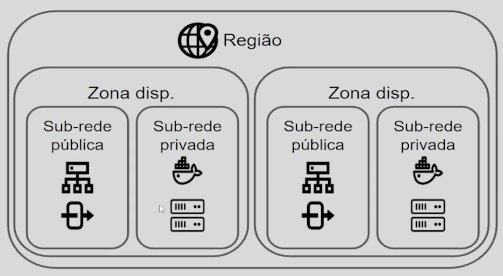

# alura-terraform-deploy-ecs

some commands:
* terraform init
* terraform plan
* terraform apply
* terraform output -> Shows the outputs from cloud
* terraform destroy -> Destry instances
* chmod 600 private-key.pem

* VPC Diagram
